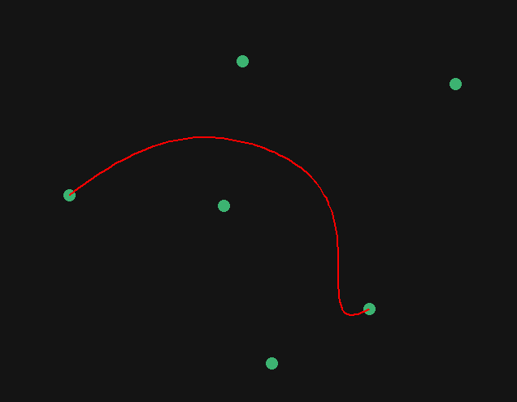

# Bezier Curves

Draw [Bezier Curves](https://fr.wikipedia.org/wiki/Courbe_de_B%C3%A9zier) using [de Casteljau algorithm](https://fr.wikipedia.org/wiki/Algorithme_de_Casteljau).



## Installation / Usage

```bash
uv run main.py
```

## Credits

Inspired by [this video from Tsoding](https://youtu.be/1epwf3iaQNU?t=465)
